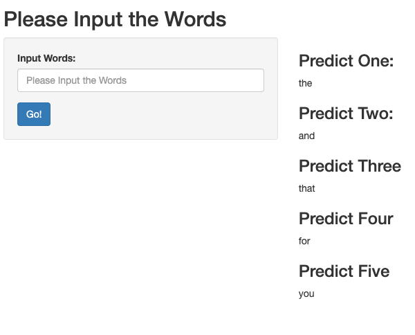

## Introduction

1. Johns Hopkins University Online Course [Capstone](https://www.coursera.org/learn/data-science-project/home/welcome)
2. Use all skills I have learned during Data Science Specialization course
3. Discover the structure in the data and how words are put together
4. Cleaning and analyzing text data
5. Building and sampling from a predictive text model
6. Build a predictive text product we can show off to others

--- .class #id 

## Getting & Cleaning Data

1. Download data from the [Coursera site](https://d396qusza40orc.cloudfront.net/dsscapstone/dataset/Coursera-SwiftKey.zip)
2. Familier with text mining knowledge
3. Familier with the datasets
    * How many megabytes each file?
    * How many words each file?
    * How many lines each file?
4. Loading data in
5. Sampling: create a separate sub-sample dataset by reading in a random subset of the original data and writing it out to a separate file

--- .class #id 

## N-Grams Model

After exploring the sampled data, build up a N-Grams model to predcit the next word. In order to decrease model size and enhance efficiency, we removed lower frequency words. In order to increase accuracy, each time shows off 5 predict words.

1. To predict the next word, we first use trigrams
2. If no trigrams found, then back off to bigrams
3. If no bigrams found, then back off to the unigrams

--- .class #id 

## Shinny App

The final product is a [Shinny App](https://zhangcc.shinyapps.io/NextWord). When you open it, you can text any word in the input. Then click `Submit` button, it will give you five prediction next words.

